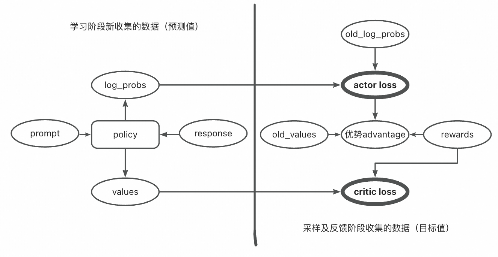

# RLHF

正式将RLHF算法应用到微调语言模型；

RLHF中包含两个重要的模型需要训练，reward模型和policy模型。

## Reward model <a href="#iz1r5" id="iz1r5"></a>


奖励模型的训练与RLHF中的基本一致，基于交叉熵损失函数拟合人类偏好（人类偏好是n选1，文中设置是4选1）：


奖励模型的输入是prompt与respond的拼接，输出是一个值score。

## Policy model <a href="#mz1ka" id="mz1ka"></a>

策略模型由语言模型搭建，主任务头（actor）负责文本输出（即最终要用的智能体）；

辅助任务头（critic）负责估算价值。

### 采样阶段 <a href="#elrdv" id="elrdv"></a>

首先使用actor进行采样（即强化学习中的episode），假设有M个prompt，每个prompt后采样长度为N的tolen（即执行N次动作），于是能够得到如下三个张量信息：

1. response：M个字符串，包含N个token；
2. old\_log\_probs：一个(M,N)形状的张量，记录了第M条回复的第N个token生成时actor给出的概率值的对数；
3. old\_values：一个(M,N)形状的张量，记录的是第M条回复加上N个token时，此状态下的状态价值，由critic模型给出。

当采样阶段完毕后，手头具备了数条episode，进入反馈阶段计算奖励值。

### 反馈阶段 <a href="#smcpk" id="smcpk"></a>


奖励值在强化学习中指基于当前环境，智能体作出动作后，环境返还的一个奖励值，在llm场景中，智能体就是actor，动作就是输出的下一个token，因此需要为每一个动作返还一个奖励值，奖励函数的整体公式如下：


下面概述每一项的来源：

1. old\_log\_prob是采样过程中记录的actor输出每个token时的对数概率；
2. ref\_log\_prob是ref model在同样的上文环境中输出该token的对数概率（ref model指最初的语言模型，经过RLHF前最初的语言模型）；
3. score是reward model根据prompt与response给出的偏好分数。

理解：

1. ref\_log\_prob是主体，其定义了actor“循规蹈矩”的程度，即输出token j（执行动作j）这个事情，ref model本身给出的概率是比较大的，说明该动作是得到ref model支持的，相应的也应当给予较大的奖励值；
2. old\_log\_prob是正则化项，即当actor执行此动作（输出此token）的概率值已经够大了，就把其奖励值适当调小，以保证概率分布有更多的多样性；
3. 只有j=N时奖励值才包含了reward model输出的score值。（直觉上是，在得到奖励模型的认可之前，只需要循规蹈矩得到ref model模型的认可即可）。

至此，每个prompt后执行的每个动作（输出token）的奖励值的计算完成，总结一下：

1. prompt与完整的response一起给到reward model得到score（代表人类偏好）；
2. prompt与response一起给到ref model，但是此时response被拆成一个一个token，用于测试产生此token时ref model给出的概率，得到ref\_log\_prob这个张量；
3. 结合old\_log\_prob就能为每个token（动作）计算其奖励值reward。

### 学习阶段 <a href="#ewimc" id="ewimc"></a>

拿到反馈后，就可以根据学习以更新policy model的参数了，注意policy model包含了actor与critic，因此这两部分有各自的损失函数。

#### 关于critic的损失函数设计 <a href="#wikmy" id="wikmy"></a>

**小tips**：critic模型实际上估算的是状态价值，因为模型输出token j 时，其输入是不包含token j的，即critic模型估算value时是不知道actor输出的动作token j的，即critic的输入是state因此认为其估算的是state value即状态价值，而不是动作价值。

所以critic的真值也很好确定，就是基于奖励函数算出来的状态价值：


注意k是从j开始算的，所以是状态价值，

于是critic的训练目标也很清晰了：


#### 关于actor的损失函数设计 <a href="#ic5cz" id="ic5cz"></a>

其核心是ppo的观念，强化优势动作

优势的计算：


损失函数：


理解：

1. 当该动作有优势时，增大其概率log\_prob以减小损失函数；
2. 当该动作无优势时，减小其概率以减小损失函数；
3. old\_log\_prob是采样时的统计结果，用于充当正则化项，即如果该动作的概率已经足够大了，让其在损失中的占比小一点，如果该动作的概率比较小，就让它在损失中的占比大一点。

### 流程

<figure><figcaption></figcaption></figure>

### 代码 <a href="#inkjk" id="inkjk"></a>

```python
// Some codecode
policy_model = load_model()
ref_policy_model = policy_model.copy()

for k in range(20000):
    # 采样
    prompts = sample_prompt()
    responses, old_log_probs, old_values = respond(policy_model, prompts)

    # 反馈
    scores = reward_model(prompts, responses)
    ref_log_probs, _ = analyze_responses(ref_policy_model, prompts, responses)
    rewards = reward_func(scores, old_log_probs, ref_log_probs)
    
    # 学习
    advantages = advantage_func(rewards, old_values)
    for epoch in range(4):
        log_probs, values = analyze_responses(policy_model, prompts, responses)
        actor_loss = actor_loss_func(advantages, old_log_probs, log_probs)
        critic_loss = critic_loss_func(rewards, values)
        loss = actor_loss + 0.1 * critic_loss
        train(loss, policy_model.parameters())
```
